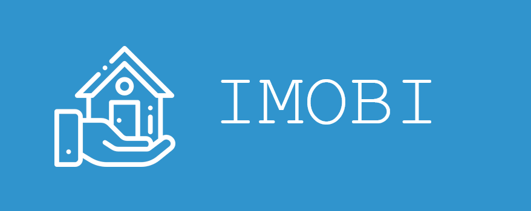
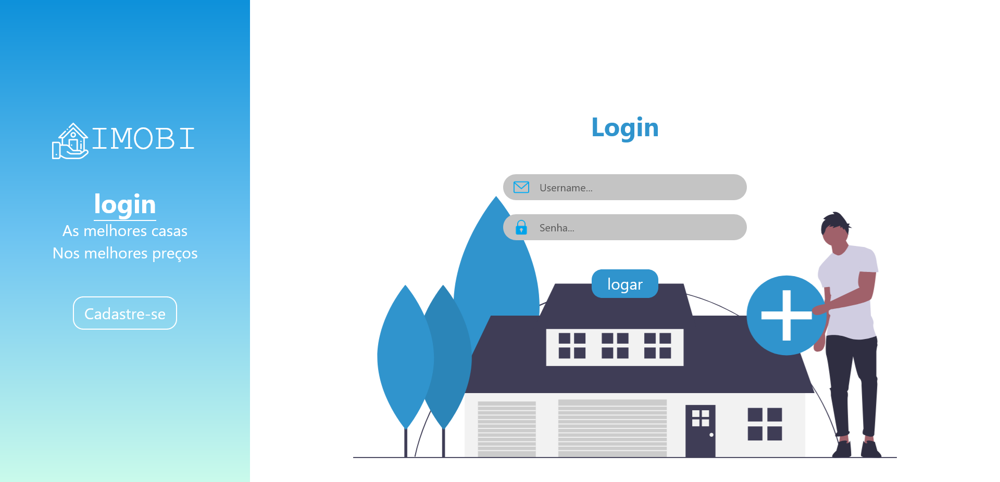
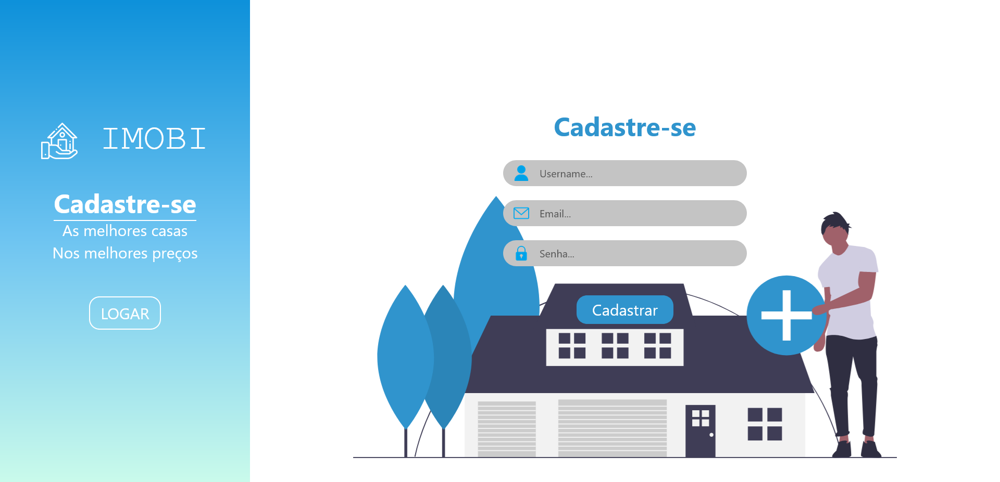
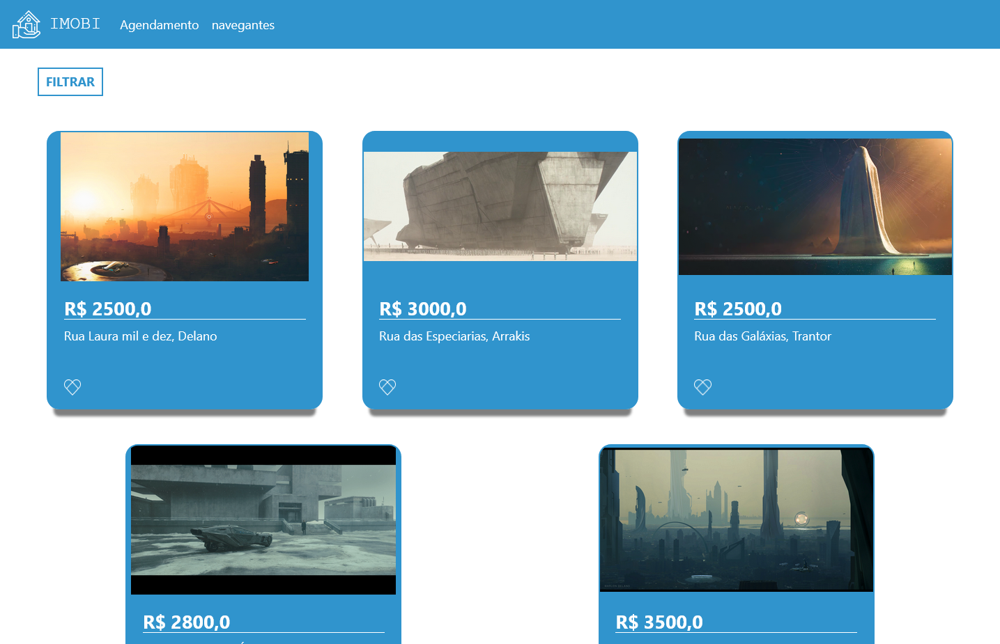
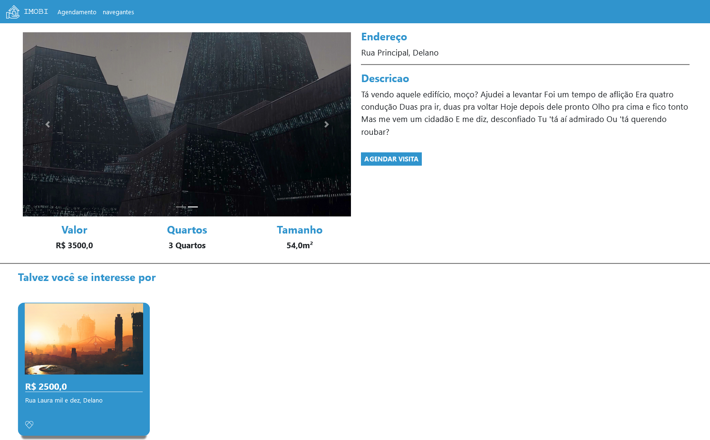
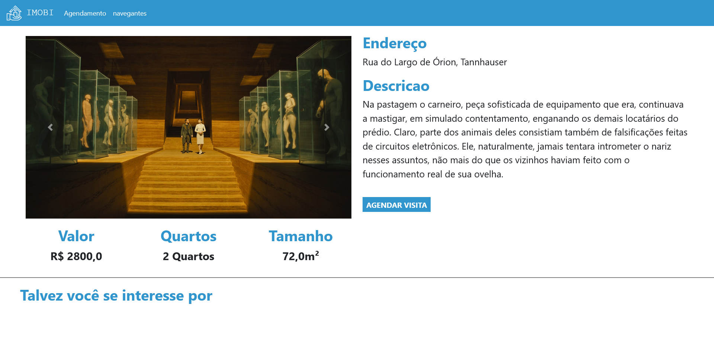
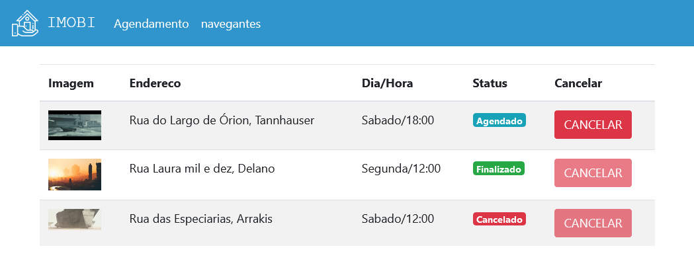
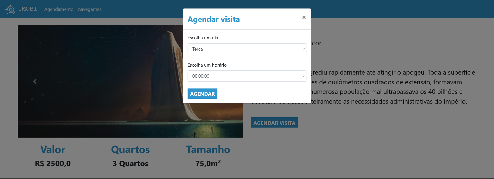
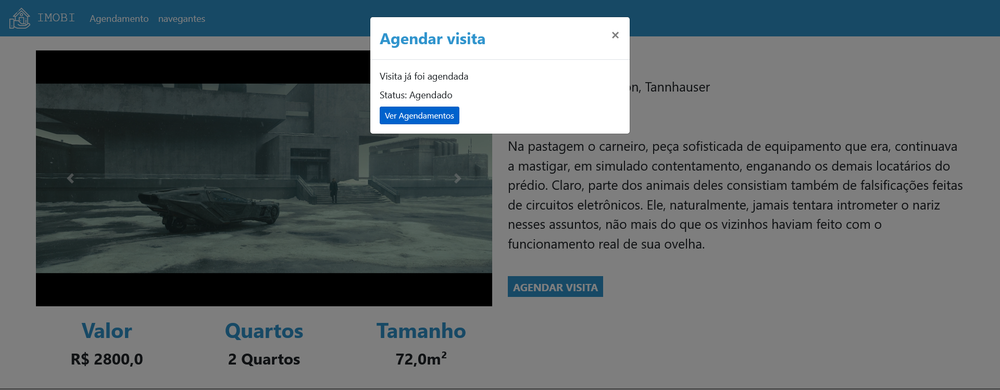

<div align="center" id="top"> 
  

<!-- &#xa0; -->
  <!-- <a href="https://imobi.netlify.com">Demo</a> -->
</div>

<h1 align="center">🏡 Imobi</h1>

<p align="center">
  

  

  

  

  <!--  -->

  <!--  -->

  <!--  -->
</p>

<!-- Status

<h4 align="center"> 
	🚧  Imobi 🚀 Em construção...  🚧
</h4> 

<hr> -->

<p align="center">
  <a href="#dart-sobre">Sobre</a> &#xa0; | &#xa0; 
  <a href="#sparkles-funcionalidades">Funcionalidades</a> &#xa0; | &#xa0;
  <a href="#rocket-tecnologias">Tecnologias</a> &#xa0; | &#xa0;
  <a href="#white_check_mark-pré-requisitos">Pré requisitos</a> &#xa0; | &#xa0;
  <a href="#checkered_flag-começando">Começando</a> &#xa0; | &#xa0;
  <a href="#memo-licença">Licença</a> &#xa0; | &#xa0;
  <a href="https://github.com/navegantes" target="_blank">Autor</a>
</p>

<div align="center" id="top"> 
  
  
  
  
  
  
  
  
</div>

## 🎯 Sobre

O Imobi é um aplicativo para web com a proposta de simular o sistema de uma imobiliaria.
O projeto foi desenvolvido durante o evento PYSTACK WEEK 2.0 da [Pythonando](https://pythonando.com.br).

## ✨ Funcionalidades

✔️ Login/Logout;\
✔️ Cadastro de usuários;\
✔️ Agendamento de imóveis;\
❌ Recuperação de senha;\
❌ Atualização de perfil;


## 🚀 Tecnologias

As seguintes ferramentas foram usadas na construção do projeto:

- [Python](https://www.python.org/)
- [Django](https://nodejs.org/en/)
- [Bootstrap](https://getbootstrap.com/)

## ✅ Pré requisitos

Antes de começar 🏁, você precisa ter o [Python](https://www.python.org/downloads/) instalado em sua maquina.

## 🏁 Começando

1🚩 Primeiro clone o repositório e entre na pasta do projeto.
```bash
# Clone este repositório
$ git clone https://github.com/navegantes/imobi.git

# Entre na pasta
$ cd imobi
```
2🚩 Depois inicie um ambiente virtual

```bash
# Criar
    $ python -m venv venv
# Ativação do ambiente virtual
  # Linux
    $ source venv/bin/activate
  # Windows
    $ .\venv\Scripts\Activate
# No powershell caso algum comando retorne um erro de permissão
# execute o comando a seguir e tente novamente:
  $ Set-ExecutionPolicy -Scope CurrentUser -ExecutionPolicy RemoteSigned
```

3🚩 Instale as dependências

```bash
  $ pip install -r requirements.txt
```

4🚩 Faça as migrações.

```bash
  $ python manage.py migrate
```

5🚩 Crie um super usuário

```bash
  $ python .\manage.py createsuperuser
```

6🚩 Inicie a aplicação

```bash
# Para iniciar o projeto
$ python manage.py runserver
# O app vai inicializar em <http://127.0.0.1:8000/>
# Para iniciar o projeto em uma porta especifica
$ python manage.py runserver <porta>
# O app vai inicializar em <http://127.0.0.1:<porta>/>
```

## 📝 Licença

Este projeto está sob licença MIT. Veja o arquivo [LICENSE](LICENSE.md) para mais detalhes.


Feito com :heart: por <a href="https://github.com/navegantes" target="_blank">Raphael Navegantes</a>

&#xa0;

<a href="#top">Voltar para o topo</a>
